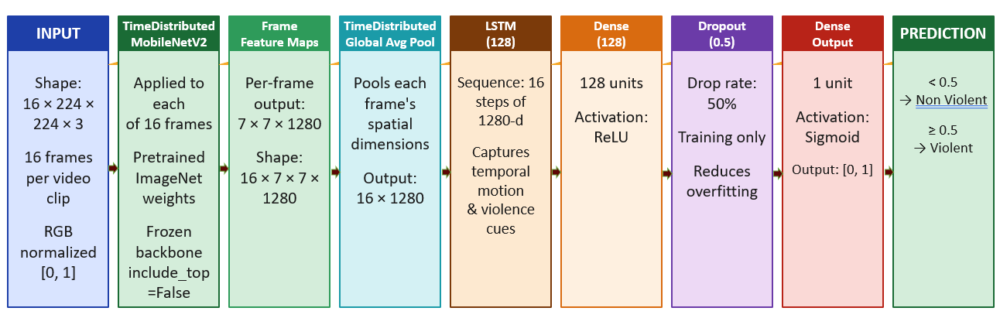
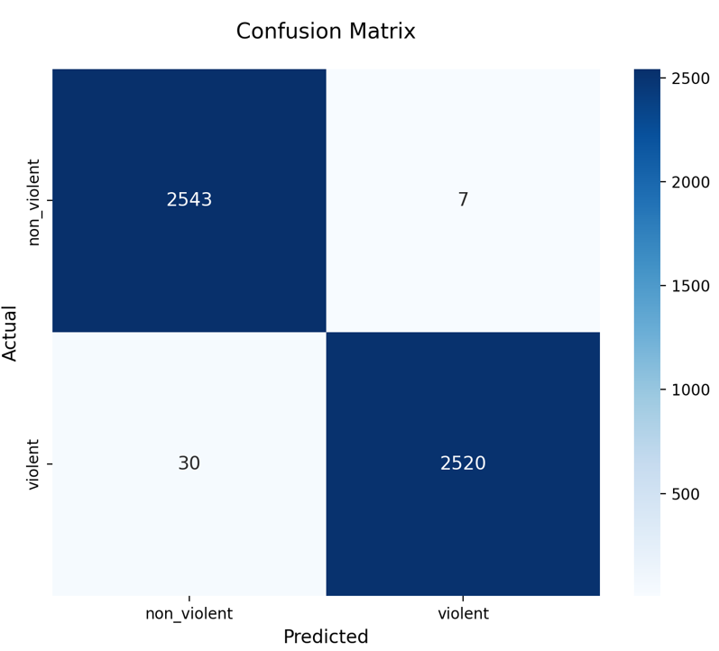
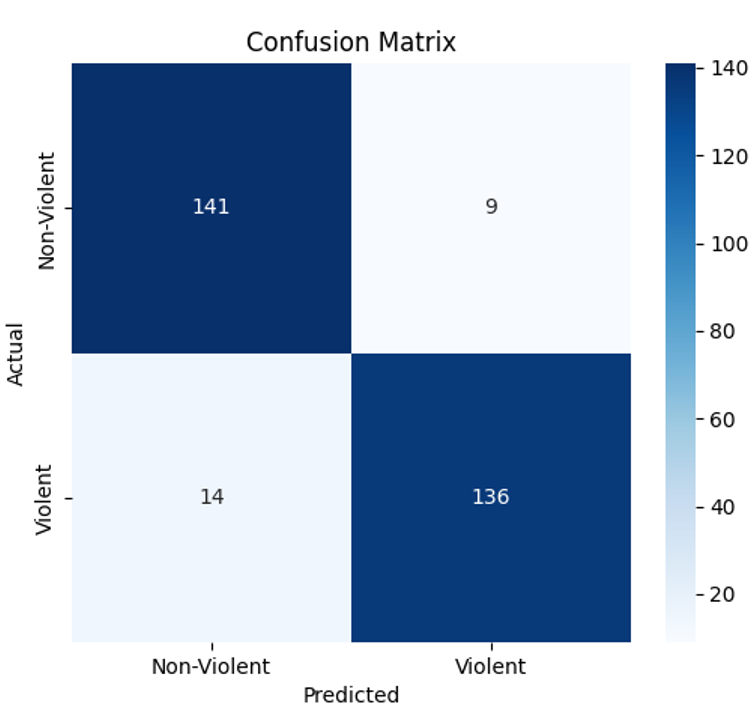
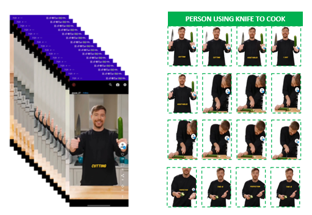

<div align="center">


# 🛡️ AI-Based Violence Detection & Content Blocking System for Android

**Real-time, on-device violence detection powered by a dual deep learning engine — no internet required, zero data leaves your device.**

[](https://www.android.com/)
[](https://www.tensorflow.org/lite)
[](https://www.java.com/)
[](https://www.python.org/)
[](https://arxiv.org/abs/1801.04381)
[](LICENSE)

---

**MCA Major Project — Manonmaniam Sundaranar University, Tirunelveli**  
*Submitted by:* **Kannan M** (Reg. No: 24084015300111213)  
*Under the guidance of:* **Dr. S. Antelin Vijila, M.E., Ph.D.**, Assistant Professor, Dept. of CSE

</div>

---

## 📋 Table of Contents

- [Overview](#-overview)
- [System Architecture](#-system-architecture)
- [Deep Learning Models](#-deep-learning-models)
  - [Model 1: 2D CNN (MobileNetV2)](#model-1-2d-cnn--mobilenetv2-based)
  - [Model 2: 3D CNN-LSTM Hybrid](#model-2-3d-cnn-lstm-hybrid)
  - [Decision Fusion](#decision-fusion)
- [Model Performance](#-model-performance)
- [Key Features](#-key-features)
- [Tech Stack](#-tech-stack)
- [System Requirements](#-system-requirements)
- [Project Structure](#-project-structure)
- [Installation & Setup](#-installation--setup)
- [How It Works](#-how-it-works)
- [Comparative Analysis](#-comparative-analysis)
- [Future Enhancements](#-future-enhancements)
- [Acknowledgements](#-acknowledgements)

---

## 🔍 Overview

Short-video platforms like Instagram Reels and YouTube Shorts are consumed by billions of users daily — including children and adolescents. Violent content (physical fights, weapon use, bloodshed) can surface in any feed at any moment, causing psychological harm before any platform-level moderation can respond.

This project introduces an **AI-Based Real-Time Violence Detection and Content Blocking System for Android** — a fully **on-device** application that:

- Monitors short videos **in real time** as they play
- Detects violent visual patterns using a **dual deep learning engine**
- **Automatically blocks** harmful content with a full-screen warning *before* the user views it
- Processes everything **locally on the smartphone** — no data ever leaves the device

> **2D CNN accuracy: 99.27%** on 5,100 test images  
> **3D CNN-LSTM accuracy: 92.33%** on 300 test video clips

---

## 🏗️ System Architecture

The system is a six-stage continuous real-time pipeline:

<div align="center">


*Figure: AI-Based Real-Time Violence Detection and Content Blocking System — Architecture Diagram*
</div>

| Stage | Module | Description |
|:---:|---|---|
| **1** | Short Video Stream | Input video captured via `MediaMetadataRetriever` |
| **2** | Frame Capture | Frames sampled at every 6th frame (~5 fps) for 2D; 16-frame sequences for 3D |
| **3** | Preprocessing | Resize to 224×224, BGR→RGB, normalize to [0, 1] |
| **4** | AI Inference Engine | 2D CNN (object-level) + 3D CNN-LSTM (action-level) run in parallel |
| **5** | Decision Fusion | Weighted 50/50 scoring → single unified confidence score |
| **6** | Content Control | Score ≥ threshold → Block overlay; otherwise → Allow playback |

The app integrates with Android's **Accessibility Service API**, enabling cross-platform monitoring across *all* short-video apps installed on the device without requiring any app-specific integration.

---

## 🧠 Deep Learning Models

### Model 1: 2D CNN — MobileNetV2 Based

Detects **frame-level** violent content: weapons, blood stains, and threatening postures within individual video frames.

<div align="center">


*Figure: 2D CNN (MobileNetV2) Architecture*
</div>

| Layer | Detail |
|---|---|
| **Input** | 224 × 224 × 3 RGB frame |
| **Backbone** | MobileNetV2 (ImageNet weights) — Stage 1: all frozen; Stage 2: last 40 layers unfrozen |
| **Feature Maps** | 7 × 7 × 1280 Conv output |
| **Global Avg Pooling** | 1280-dim vector |
| **Dense (256)** | ReLU activation |
| **Dropout (0.5)** | Regularization |
| **Output** | 1 unit, Sigmoid → `< 0.5` Non-Violent / `≥ 0.5` Violent |

**Training details:**
- Optimizer: Adam (lr=1e-4, fine-tune lr=1e-5)
- Loss: Binary cross-entropy
- Callbacks: EarlyStopping, ReduceLROnPlateau, ModelCheckpoint
- Deployment: Converted to `.tflite` with post-training quantization (DEFAULT optimization)

---

### Model 2: 3D CNN-LSTM Hybrid

Detects **action-level temporal** violence across sequences of 16 consecutive frames — capturing motion dynamics that a single frame cannot reveal.

<div align="center">


*Figure: 3D CNN-LSTM Hybrid Architecture*
</div>

| Layer | Detail |
|---|---|
| **Input** | 16 × 224 × 224 × 3 (16-frame video clip) |
| **TimeDistributed MobileNetV2** | Applied independently to each of the 16 frames (frozen, ImageNet weights) |
| **Frame Feature Maps** | 16 × 7 × 7 × 1280 |
| **TimeDistributed Global Avg Pool** | 16 × 1280 |
| **LSTM (128)** | Captures temporal motion & violence cues across 16 time steps |
| **Dense (128)** | ReLU activation |
| **Dropout (0.5)** | Regularization |
| **Output** | 1 unit, Sigmoid → `< 0.5` Non-Violent / `≥ 0.5` Violent |

**Training details:**
- Optimizer: Adam (lr=1e-4)
- Callbacks: EarlyStopping (patience=5), ReduceLROnPlateau, ModelCheckpoint
- Deployment: Saved as `.tflite` with FP16 quantization

---

### Decision Fusion

Both model outputs are combined via a **weighted 50/50 scoring** mechanism:

```
Final Score = (0.5 × 2D_CNN_score) + (0.5 × 3D_CNN_score)

IF Final Score ≥ threshold → VIOLENT → Block Content
ELSE                        → NON-VIOLENT → Allow Playback
```

The fusion approach significantly reduces both false positives and false negatives compared to either model alone.

---

## 📊 Model Performance

### 2D CNN — Frame-Level Results (Test Set: 5,100 images)

<div align="center">


*Confusion Matrix — 2D CNN (MobileNetV2)*
</div>

| Metric | Score |
|---|---|
| **Accuracy** | **99.27%** |
| True Positives (Violent correctly identified) | 2,520 |
| True Negatives (Non-violent correctly identified) | 2,543 |
| False Positives | 7 |
| False Negatives | 30 |

---

### 3D CNN-LSTM — Clip-Level Results (Test Set: 300 video clips)

<div align="center">


*Confusion Matrix — 3D CNN-LSTM*
</div>

| Metric | Score |
|---|---|
| **Accuracy** | **92.33%** |
| True Positives | 136 |
| True Negatives | 141 |
| False Positives | 9 |
| False Negatives | 14 |

---

### Frame Extraction & Clip Sampling

<div align="center">


*3D Model: 16-frame clip sampling from a short video*
</div>

- **2D model:** Samples every 6th frame (FRAME_SKIP = 6) → ~5 fps effective analysis rate
- **3D model:** Captures 16 consecutive frames per clip with a stride of 3 frames between each sample

---

## ✨ Key Features

| Feature | Description |
|---|---|
| 🔒 **100% On-Device** | All inference runs locally via TensorFlow Lite. No video data ever transmitted externally |
| ⚡ **Real-Time Blocking** | Content is intercepted and blocked *before* the user views it |
| 🌐 **Platform-Agnostic** | Works across all short-video apps via Android Accessibility Service API |
| 🧠 **Dual-Model Fusion** | 2D CNN (spatial) + 3D CNN-LSTM (temporal) = context-aware detection |
| 📵 **Offline Capable** | Fully functional with zero internet connectivity |
| 🔘 **One-Tap Control** | Simple toggle in Settings to enable/disable protection instantly |
| 🏃 **Background Service** | Persistent monitoring without any manual intervention |
| 📱 **Lightweight** | ~300 MB install footprint; runs on mid-range Android hardware |

---

## 🛠️ Tech Stack

### Model Training (Python)

| Library | Version | Purpose |
|---|---|---|
| Python | 3.10.x | Core ML pipeline language |
| TensorFlow / Keras | 2.15.x | Model design, training, and TFLite conversion |
| OpenCV-Python | 4.8.x | Video reading, frame extraction, preprocessing |
| Scikit-learn | Latest | Dataset splitting, confusion matrix, classification report |
| NumPy | Latest | Tensor operations on image/video data |
| Pandas | Latest | Metadata management and result analysis |
| Matplotlib / Seaborn | Latest | Training curves and evaluation plots |

### Android Application (Java)

| Tool | Version | Purpose |
|---|---|---|
| Android Studio | Iguana (2023.2.1) | Full IDE, SDK, Gradle, APK build pipeline |
| Java | JDK 17 | App logic, Accessibility Service, inference threading |
| TensorFlow Lite | Latest | On-device model inference runtime |
| OpenCV for Android | 4.8.x | Real-time frame preprocessing on-device |

---

## 💻 System Requirements

### End-User (Android Device)

| Requirement | Specification |
|---|---|
| OS | Android 8.0 (API Level 26) or higher |
| Processor | 64-bit octa-core (e.g., Qualcomm Snapdragon 6-series) |
| RAM | 4 GB minimum |
| Storage | 300 MB available |
| Permissions | Accessibility Service, Display Overlay, Storage Access |

### Development Machine

| Requirement | Specification |
|---|---|
| OS | Windows 11 / macOS Ventura / Ubuntu 22.04 LTS |
| Processor | Intel Core i5 / AMD Ryzen 5 or above |
| RAM | 8–16 GB |
| GPU | NVIDIA GTX 1060 or higher (for model training) |
| Storage | 512 GB SSD or larger |

---

## 📁 Project Structure

```
violence_detector/
│
├── model_training/
│   ├── 2d_cnn_training.py          # MobileNetV2 2D CNN training script
│   ├── 3d_cnn_lstm_training.py     # 3D CNN-LSTM hybrid training script
│   ├── dataset/
│   │   ├── 2d_dataset/
│   │   │   ├── train/
│   │   │   │   ├── violent/        # Violent images
│   │   │   │   └── nonviolent/     # Non-violent images
│   │   │   ├── val/
│   │   │   └── test/
│   │   └── 3d_dataset/
│   │       ├── train/
│   │       │   ├── violent/        # Violent video clips
│   │       │   └── nonviolent/     # Non-violent video clips
│   │       ├── val/
│   │       └── test/
│   └── models/
│       ├── violence_mobilenet_model.tflite   # 2D CNN TFLite model
│       └── violence_model_fp16.tflite        # 3D CNN-LSTM TFLite model (FP16)
│
├── android_app/
│   ├── app/
│   │   ├── src/main/
│   │   │   ├── java/
│   │   │   │   └── com/kannan/violencedetector/
│   │   │   │       ├── MainActivity.java
│   │   │   │       ├── ViolenceDetectorService.java   # Accessibility Service
│   │   │   │       ├── InferenceEngine.java           # TFLite inference wrapper
│   │   │   │       └── BlockOverlayActivity.java      # Blocking UI
│   │   │   ├── assets/
│   │   │   │   ├── violence_mobilenet_model.tflite
│   │   │   │   └── violence_model_fp16.tflite
│   │   │   └── res/
│   │   │       └── layout/
│   │   └── build.gradle
│   └── build.gradle
│
└── README.md
```

---

## 🚀 Installation & Setup

### 1. Clone the Repository

```bash
git clone https://github.com/knkannan70/violence_detector.git
cd violence_detector
```

### 2. Set Up the Python Training Environment

```bash
# Create a virtual environment
python -m venv venv
source venv/bin/activate       # Linux/macOS
# venv\Scripts\activate        # Windows

# Install dependencies
pip install tensorflow==2.15.0 opencv-python scikit-learn numpy pandas matplotlib seaborn
```

### 3. Train the Models

**2D CNN (MobileNetV2):**
```bash
# Prepare your image dataset at model_training/dataset/2d_dataset/
python model_training/2d_cnn_training.py
# Output: violence_mobilenet_model.tflite
```

**3D CNN-LSTM:**
```bash
# Prepare your video dataset at model_training/dataset/3d_dataset/
python model_training/3d_cnn_lstm_training.py
# Output: violence_model_fp16.tflite
```

### 4. Build the Android App

1. Open `android_app/` in **Android Studio Iguana (2023.2.1)** or later
2. Copy the generated `.tflite` model files into `app/src/main/assets/`
3. Sync Gradle and build the project (`Build → Make Project`)
4. Run on a physical Android device (API 26+)

### 5. Enable the App

1. Open the app on your Android device
2. Grant **Accessibility Service** permission when prompted
3. Grant **Display Over Other Apps** permission
4. Toggle **Enable Violence Block** in Settings → done!

---

## ⚙️ How It Works

```
User opens a short-video app (Instagram, YouTube Shorts, etc.)
           │
           ▼
Android Accessibility Service intercepts the video playback event
           │
           ▼
MediaMetadataRetriever extracts frames from the video URI
           │
      ┌────┴────┐
      ▼         ▼
  2D CNN     3D CNN-LSTM
(every 6th  (16 consecutive
  frame)      frames/clip)
      │         │
      └────┬────┘
           ▼
  Decision Fusion (50/50 weighted score)
           │
    ┌──────┴──────┐
    │             │
Score ≥ 0.5   Score < 0.5
    │             │
    ▼             ▼
Block Overlay  Allow video
+ Warning UI   to play
```

---

## 📊 Comparative Analysis

| Feature | Existing Systems | This System |
|---|---|---|
| Detection Approach | Manual / Rule-based / Cloud AI | On-device Dual Deep Learning |
| Real-Time Blocking | ❌ Reactive only | ✅ Proactive, pre-view blocking |
| Internet Required | ✅ Yes (cloud AI) | ❌ No — fully offline |
| User Privacy | ❌ Video sent to external servers | ✅ All processing on-device |
| Temporal Understanding | ❌ Frame-level or metadata only | ✅ 16-frame sequence analysis |
| False Positive Rate | ❌ High (rule-based) | ✅ Low — fusion reduces FP/FN |
| Platform Coverage | ❌ Platform-specific only | ✅ All Android short-video apps |
| User Control | ❌ Platform-controlled | ✅ Full user toggle control |
| Scalability | ❌ Requires server infrastructure | ✅ Any Android 8.0+ device |

---

## 🔮 Future Enhancements

- **Multi-class classification** — extend beyond binary (violent/non-violent) to detect specific violence subtypes (weapons, fights, gore)
- **Audio analysis integration** — fuse audio-based violence cues (screams, gunshots) with visual detection
- **Adaptive threshold calibration** — personalized sensitivity settings per user
- **iOS port** — extend on-device detection to Apple devices via Core ML
- **Parental control dashboard** — detailed logging and reporting interface for parents
- **Federated learning** — improve models over time without exposing any user data
- **Lightweight model optimization** — further quantization (INT8) for lower-end devices

---

## 📚 References

1. K. Simonyan and A. Zisserman, *Very Deep Convolutional Networks for Large-Scale Image Recognition*, ICLR, 2015
2. M. Sandler et al., *MobileNetV2: Inverted Residuals and Linear Bottlenecks*, CVPR, 2018
3. D. Tran et al., *Learning Spatiotemporal Features with 3D Convolutional Networks*, ICCV, 2015
4. A. R. Abdali and R. F. Al-Tuma, *Robust Real-Time Violence Detection in Video Using CNN and LSTM*, SCCS, 2019
5. TensorFlow Team, *TensorFlow Lite Guide*, https://www.tensorflow.org/lite
6. Google, *Android Accessibility Service API*, https://developer.android.com/reference/android/accessibilityservice/AccessibilityService

---

## 🙏 Acknowledgements

- **Dr. S. Antelin Vijila, M.E., Ph.D.** — Project Guide, Dept. of CSE, Manonmaniam Sundaranar University
- **Dr. R. S. Rajesh, M.E., Ph.D.** — Head of Department, Dept. of CSE
- **Manonmaniam Sundaranar University, Tirunelveli** — for providing the research environment

---

<div align="center">

**Made with ❤️ by Kannan M**  
MCA — Manonmaniam Sundaranar University | April 2026

</div>
